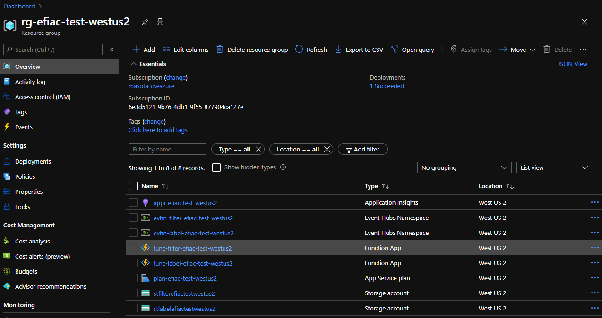

# Overview
This repo helps developers to provision Azure resources with best practice for scaling out Azure Functions and Event Hub as real time processing application.

For understanding best practice, please read [this my blog](https://masayukiota.medium.com/scaling-out-azure-functions-with-event-hubs-effectively-2-55d143e2b793).

# Prerequisites
## Environment
This repo uses Terraform. I expect you to prepare your Terraform Environment from one of following methods.
- Use [Dev Container](https://code.visualstudio.com/docs/remote/containers). You can utilize dev container which I made for this repo.
- Install [Terraform CLI](https://www.terraform.io/docs/cli-index.html) and [Azure CLI](https://docs.microsoft.com/en-us/cli/azure/install-azure-cli)

## Basic knowledge
- Have finished [Terraform tutorial](https://learn.hashicorp.com/collections/terraform/azure-get-started)

# How to run 
1. Update `test.tfvars` file. You should specify your unique `app_name`. Otherwise, Terraform may fail to provision because there are already same name resource in the world. 
1. `cd terraform`
1. `terraform init`
1. `terraform plan -var-file="./env/test/test.tfvars"`
1. `terraform apply -var-file="./env/test/test.tfvars" -auto-approve`

Then, you can see provisioned resource in your Azure.

# Appendix
- I utilizes best practice for naming and tagging Azure resources. Please see [this document](https://docs.microsoft.com/en-us/azure/cloud-adoption-framework/ready/azure-best-practices/naming-and-tagging) for more detail.
- You should consider to use KeyVault for keeping your connection string securely in production. I don't use it in this repo for understanding best practice easily.